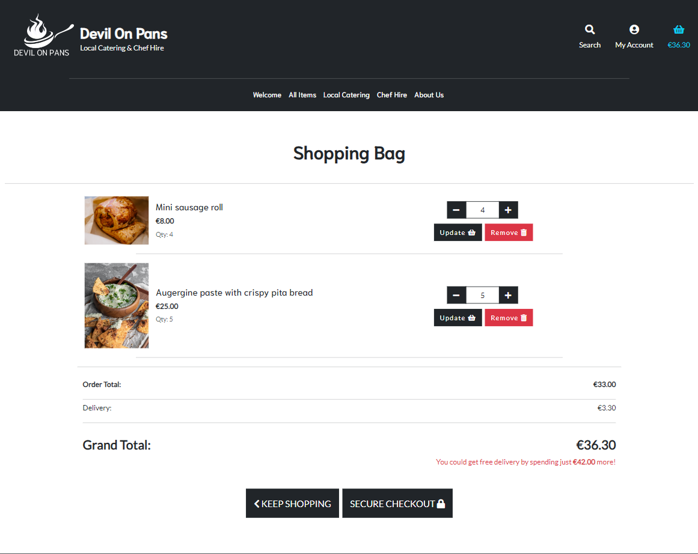

# DEVIL ON PANS

[amiresponsive](https://ui.dev/amiresponsive)

[live link](https://devil-on-pans-8a8a58db0f75.herokuapp.com)

## CONTENTS
- [Project Overview](#project-overview)
- [User Experience](#user-experience)
    - [User Stories](#user-stories)

- [Design](#design)
    - [Colors](#colors)
    - [Typography](#typograpy)
    - [Wireframes](#wireframes)

- [Agile](#agile)

- [Features](#features)

- [Technologies](#technologies)
    - [Languages](#languages)
    - [Django packages](#django-packages)
    - [Frameworks - Libraries - Programs](#frameworks---libraries---proograms)

- [Testing](#testing)

- [Deployment](#deployment)
    - [Create Django Project](#create-django-project)
    - [Deploy to Heroku](#deploy-to-heroku)
    - [How to Fork](#how-to-fork)
    - [How to Clone](#how-to-clone)

- [Credits](#credits)
    - [Code](#code)
    - [Content](#content)

- [Acknowledgements]

## PROJECT OVERVIEW 

The Devil On Pans idea was born a good while ago as myself and my partner found passion for food. The goal is to create an online presence for the chef and the team. On the website users can purchase delicasies, pre-order for events or hire a chef for private events. The project is realized with Django. 

## USER EXPERIENCE

### USER STORIES

|ID|User Stories|
|--|:---|
|[1] | As a **user** I can **register for an account** so that **I can login to place and manage orders**
|[2] | As a **user** I can **intuitively navigate the page, on all screen sizes** so that **I can access all the site content**
|[3] | As a **user** I can **land on an intuitive, welcoming and simple site** so that **I can understand the purpose easily**
|[4] | As a **user** I can **see lists of items for sale** so that **I can possibly purchase them**
|[5] | As a **user** I can **access the details of each item** so that **I can read and inform before purchase**
|[6] | As a **user** I can **see the allergens of the items** so that **I can avoid any serious health complications**
|[7] | As a **user** I can **search and sort** so that **I can easily find an item I am looking for**
|[8] | As a **user** I can **see a categorised menu** so that **finding and viewing similar items is easier**
|[9] | As a **user** I can **see a shopping bag** so that **I can review my items**
|[10] | As a **user** I **receive an on-screen notifications on my actions** so that **I am fully aware**
|[11] | As a **user** I can **view the total and selected items in my bag** in order to **not overspend my budget**
|[12] |As a **user** I can **add/update/remove items from my bag** in order to **have a better shopping experience**
|[13] |As a **user** I can **see the contents of my bag in the checkout** so that **I can modify it before purchasing if needed**
|[14] |As a **user** I can **see the contents of my bag in the checkout** so that **I can modify it before purchasing if needed**
|[15] |As a **user** I can **enter my payment info** so that **I can easily checkout**

|ID|Admin User Stories|
|--|:---|
|[1]|As an **admin user** I can **access the admin panel** so that **I have access to all the site information when needed**
|[2]|As an **admin user** I can **add catering items to the website** so that **they can be purchased**
|[3]|As an **admin user** I can **view the orders in the admin panel** so that **I can keep track of sales**

## BUSINESS MODEL

The website is a B2C model, selling catering items and services to the users. The checkout process is quick and easy and registration is not mandatory to place a purchase. The business is local and small, advertised on Facebook directly to it's target audience, potential customers from around Sligo. 
The site uses a simple mail signup subscription form to attract more customers.

The E-commerce store will be useful to the business owner to publish and sell new dishes and grow in popularity as well. The payment system is easy and straight forward, lifting overhead and the site also gives the ability to the user to manage the site. 

## DESIGN

### COLORS

For the color and style scheme Bootstrap5 CSS classes are used and are mainly based on the Boutique Ado walkthrough project. We found that the dark theme works well with the white and keeps the site visually pleasant. For the buttons and other elements the same dark theme is used, with different letter spacing depending on the size of the button.

### DATABASE

### AGILE

- GitHub issues and Github Projects were used to plans and manage the development process.  
- User Stories and Tasks were organized into Epics which then in Milestones
- Some issues have been moved around over the course of development 
- User stories have also been labeled according to the MoSCoW method.
- As issues were handled they have been moved from the  **Todo this Iteration**, to **In Progress**, to **Done**. If an issue couldn't be approached it was moved back to the **Backlog** for reconsideration, then into **Won't Have** if couldn't be implemented.
- The use of Agile has made the development process more efficient during active working times. Most of the calculations were made before major coding was done. 

#### Iterations planning

|Iteration|Description|Comment|
|:--|:--|:--|
|Iteration 0|Project preparation and environment set up| Done
|Iteration 1|Create Base templates and add registration with Django Allauth| Done
|Iteration 2|Catering app and admin access| Done
|Iteration 3|Shopping Bag| Done
|Iteration 4|Checkout App and Stripe | Done
|Iteration 5|User Profile and management views | no time
|Iteration 6|Chef Hire App & Daily specials | no time
|Iteration 7|Finish MVP and final touches | no time

Additional issues and tasks were planned, unfortunately due to unexpected setbacks and running out of time, these won't be implemented on at this time.

[Github Project Board](https://github.com/users/noemichis/projects/7)

[Github issues](https://github.com/noemichis/devil-on-pans/issues)

## FEATURES

### Landing page

- Hero image with order and hire buttons

### Navbar

- Navigation menu and links working
- Navigation turns into hamburger dropdown on smaller screens
- Dropdown search bar functionality 

### Footer

- Simple Footer with social links and Newsletter

### Catering items page

- Catering items can be sorted on All Items page
- Item detail button is disabled if item out of stock

### Item Details page

- Contains Item details retrieved from the Database
- Contains quantity selector with stock number integrated from database and is disabled if quantity reaches the max number

- Add to basket feature, which is disabled if item out of stock

### Shopping bag

- Shopping bag contains all items to be purchased with the possibility to modify or delete them
- Secure checkout and keep shopping buttons

### Checkout page

- Checkout order item summary available to user 
- Order form requires input
- Redirects to Success page

### Error pages

- 404 error page

### Login/logout/registration

- No Register option if user logged in
- Logout confirmation
- Form validation

### Toasts

- Django messages combined with toasts are used for user feedback with different tags

### Future implementations

Due to unforseen circumstances in the developers life this project is not fully finished and will need more future feature implementations.

- Profile
- Product Admin
- Chef Hire
- Wishlist feature

## TECHNOLOGIES

### LANGUAGES

- [Django](https://www.python.org/)
- [Python](https://www.djangoproject.com/)
- [HTML 5](https://en.wikipedia.org/wiki/HTML/)
- [CSS 3](https://en.wikipedia.org/wiki/CSS)

### DJANGO PACKAGES

- [Gunicorn](https://gunicorn.org/) - server for Heroku
- [django-allauth](https://django-allauth.readthedocs.io/) - user authentication
- [psycopg2](https://pypi.org/project/psycopg2/) - PostgreSQL db Adapter
- [boto3](https://pypi.org/project/boto3/) -AWS SDK for Phyton
- [dj-database-url](https://pypi.org/project/dj-database-url/) - use with database urls
- [django-countries](https://pypi.org/project/django-countries/) - provides country fields to forms
- [django-storages](https://pypi.org/project/django-storages/) - Django backend custom storage
- [gunicorn](https://pypi.org/project/gunicorn/) - WSGI interface for Heroku deployment
- [Pillow](https://pypi.org/project/Pillow/) 
- [stripe](https://pypi.org/project/stripe/) - Stripe API

### FRAMEWORKS - LIBRARIES - PROGRAMS

- [GitHub](https://github.com/) - version control and source code
- [Gitpod](https://gitpod.io) - cloud development environment
- [Heroku](https://www.heroku.com/) - live deployment of project
- [Bootstrap5](https://getbootstrap.com/) - easy use predefined styles
- [crispy-bootsrap](https://pypi.org/project/crispy-bootstrap5/) - integrate with Bootstrap %
- [Jquery](https://jquery.com/) - use with own script
- [ElephantSQL](https://www.elephantsql.com/) - PostgreSQL as a service
- [Figma](https://www.figma.com) - wireframe design
- [LucidChart](https://lucid.app/) - ERD diagram design
- [Lighthouse](https://developer.chrome.com/docs/lighthouse/overview/)
- [Font Awesome](https://fontawesome.com/) - icons
- [Google Fonts](https://fonts.google.com/) - typography
- [CANVA](https://www.canva.com/) - help with logo design
- [Amazon AWS](https://aws.amazon.com/) - Cloud file storage
- [Mailchimp](https://mailchimp.com/) - Creates the signup form
- [Stripe](https://stripe.com/gb) - Payment system
- [W3C Markup validation Service](https://validator.w3.org/) - validate HTML
- [The W3C CSS Validation Service](https://jigsaw.w3.org/) - validate CSS
- [JSHint](https://jshint.com/) - validate jQuery
- [Am I Responsive](https://ui.dev/) - test responsiveness on different devices
- [CI Python Linter](https://pep8ci.herokuapp.com/) - validate python code
- [Code Spell Checker](https://open-vsx.org/extension/streetsidesoftware/code-spell-checker) - VS Code extension 
- [Google Chrome Dev Tools](https://developer.chrome.com/docs/devtools/) - VS Code extension

## TESTING

All testing can be found at [TESTING.md](TESTING.md)

## DEPLOYMENT 

### PREPARATION 

1. Hide `SECRET_KEY` from settings.py -> create config vars in Heroku and Gitpod
2. Update `DEBUG` to be TRUE only in dev environment
3. Create DATABASE instance on ElephantSQL
4. Wire up DB: set `DATABASE_URL` in Heroku and locally:
5. Make migrations: *python3 manage.py makemigrations --dry-run* to test, if no error *python3 manage.py makemigrations*
6. Migrate: *python3 manage.py migrate --plan* to test, if no error *python3 manage.py migrate*
7. Set up AWS group and policy -> export json with keys 
8. Add AWS variables to settings.py and Herokus config vars
9. Remove `Disable Collecstatic` from Heroku
10. Add Heroku link to ALLOWED APPS in setting.py
11. Create Procfile
12. Push changes to Github

### HEROKU DEPLOYMENT

1. In Heroku navigate to `Deploy`  and choose *Github* as `Deployment method`
2. `Enable Automatic Deploys` if you want deploy new version after every push
3. `Manual Deploys` if you want to control all deployments
4. `View` link will be provided to navigate to the deployed page
5. For issues after deployment use Heroku logs under `More`

### HOW TO FORK

1. Go to GitHub
2. Find the `Fork` button on the top of the page and expand
3. Select `Create a new Fork`

A forked version of the project will appear in your repository 

### HOW TO CLONE

1. OpeGo to GitHub
2. Find the `<>Code` dropdown and expand
3. You can select from HTTPS, SSH or GitHub CLI
4. Once selected and copied the project will appear in you repository
5. Open an IDE
6. Enter `git clone` followed by the URL
7. Clone created

## CREDITS

### CODE

- The Code Institute's [Boutique Ado](https://github.com/Boiann/boutique_ado) was used as a skeleton, tried to integrate as many features as time permited.
- [Django](https://docs.djangoproject.com/en/4.2/) documentation is used throughout development as an upgraded version for most packages is used
- [Bootstrap5](https://getbootstrap.com/docs/5.2/getting-started/introduction/) documentation used
- [Djangocentral](https://djangocentral.com/)
- [django-allauth](https://django-allauth.readthedocs.io/en/latest/#)
- [Stack Overflow](https://stackoverflow.com/) - used a lot during deployment issues to read what others suggest

### CONTENT

- The images are sourced from [Unsplash](https://unsplash.com/)
- The items description and recieps belong to my partner. 

## ACKNOWLEDGEMENTS

- I am greatly thankful to my partner. His support was just unmatched over the past year and helped me stay motivated until the end, regardless the recent difficulties.

- All the resources Code Institute has offered us and the Slack community. 