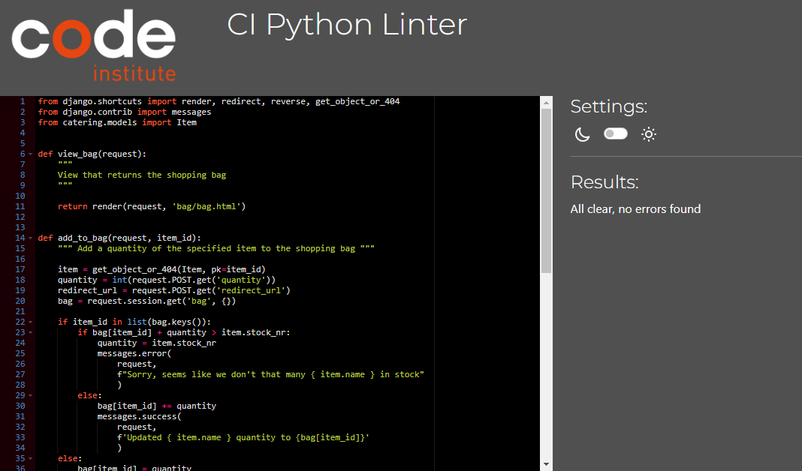

Back to [README.md](README.md)

- [Testing](#testing)
    - [Code validation](#code-validation)
        - [HTML](#html)
        - [CSS](#css)
        - [JavaScript](#java-script-elements)
        - [Python Code](#python-code)
    - [User story testing](#user-story-testing)
    - [Feature testing](#feature-testing)
    - [Lighthouse performance](#lighthouse-performance)

- [Bugs](#bugs)

## TESTING

Testing has taken place at all stages of development. Each feature has been released after it was functional.

User Stories have been tested before closure. 

### Code validation

#### HTML
Tested with [W3C Markup validation Service](https://validator.w3.org/)

HTML Validation:

- 

Home

- 

Catering

- 

Item details

- 

Admin Add Item

- 

Admin Edit Item

- 

Admin Create Allergen

- 

Bag

- 

Checkout

- 

Hire Packages

- 

Hire Requests

- 

Admin Hire Requests List

- 

Profile

#### CSS
Tested with [The W3C CSS Validation Service](https://jigsaw.w3.org/)

CSS Validation:

 - 

Main

 - 

Checkout

 - 

Hire

 - 

Profile

### Java Script elements
Tested with [JsHint](https://jshint.com/)

JsHint results

All JS elements have been included in this test with no errors, just minor warnings.

#### Python Code
Tested with [CI Python Linter](https://pep8ci.herokuapp.com/)

Python Validation:

- 

Bag

    - contexts.py 
    
    - bag_tools.py 
    
    - urls.py 
    
    - views.py 
    

- 

Catering

    - admin.py 
    
    - forms.py 
    
    - models.py 
    
    - contexts.py 
    
    - urls.py 
    
    - views.py 
    
    - widgets.py 
    

- 

Checkout

    - admin.py 
    
    - forms.py 
    
    - models.py 
    
    - signals.py 
    
    - urls.py 
    
    - views.py 
    

- 

Hire

    - admin.py 
    
    - forms.py 
    
    - models.py 
    
    - tools.py 
    
    - urls.py 
    
    - views.py 
    

- 

Home

    - urls.py 
    
    - views.py 
    

- 

Profile

    - urls.py 
    
    - views.py 
    
    - models.py 
    
    - forms.py 
    

- 

Main App: devil_on_pans 

    - urls.py 
    
    - views.py 
    
    - custom_storage.py 
    

### USER STORY TESTING

|User Story|Test Case|
|:---|:---|
|[As a user I can register for an account so that I can login to place and manage orders](https://github.com/noemichis/devil-on-pans/issues/5)|Pass|
|[As a user I can recieve a registration confirmation email so that I have confirmation and know my account is secure](https://github.com/noemichis/devil-on-pans/issues/6)|Pass|
|[As a user I can intuitively navigate the page, on all screen sizes so that I can access all the site content](https://github.com/noemichis/devil-on-pans/issues/10)|Pass|
|[As a user I can land on an intuitive, welcoming and simple site so that I can understand the purpose easily](https://github.com/noemichis/devil-on-pans/issues/11)|Pass|
|[As a user I can see a footer on every page so that I easily access social media links or other relevant information](https://github.com/noemichis/devil-on-pans/issues/13)|Pass|
|[As a user I can access the details of each item so that I can read and inform before purchase](https://github.com/noemichis/devil-on-pans/issues/19)|Pass|
|[As a user I can see the allergens of the items so that I can avoid any serious health complications](https://github.com/noemichis/devil-on-pans/issues/19)|Pass|
|[As a user I can search and sort so that I can easily find an item I am looking for](https://github.com/noemichis/devil-on-pans/issues/21)|Pass|
|[As a user I can see a categorised menu so that finding and viewing similar items is easier](https://github.com/noemichis/devil-on-pans/issues/22)|Pass|
|[As a user I can see a shopping bag so that I can review my items](https://github.com/noemichis/devil-on-pans/issues/25)|Pass|
|[As a user I can view the total and selected items in my bag in order to not overspend my budget](https://github.com/noemichis/devil-on-pans/issues/30)|Pass|
|[As a user I can select the quantity of the items in order to increase or decrease their number](https://github.com/noemichis/devil-on-pans/issues/31)|Pass|
|[As a user I can add/update/remove items from my bag in order to have a better shopping experience](https://github.com/noemichis/devil-on-pans/issues/32)|Pass|
|[As a user I can see the contents of my bag in the checkout so that I can modify it before purchasing if needed](https://github.com/noemichis/devil-on-pans/issues/35)|Pass|
|[As a user I can enter my payment info so that I can easily checkout](https://github.com/noemichis/devil-on-pans/issues/36)|Pass|
|[As a user I can securely checkout so that my personal data is protected](https://github.com/noemichis/devil-on-pans/issues/37)|Pass|
|[As a user I receive a confirmation email after my purchase so that I know my order has been received](https://github.com/noemichis/devil-on-pans/issues/38)|Pass|
|[As a user I can have access to a profile page so that I can view my previous orders](https://github.com/noemichis/devil-on-pans/issues/44)|Pass|
|[As a user I can update my profile information so that my details are always up to date](https://github.com/noemichis/devil-on-pans/issues/45)|Pass|
|[As a user I can access a booking/hiring form so that I can request to book ahead for a private event](https://github.com/noemichis/devil-on-pans/issues/54)|Pass|

|Admin User Story|Test Case|
|:---|:---|
|[As an admin user I can access the admin panel so that I have access to all the site information when needed](https://github.com/noemichis/devil-on-pans/issues/7)|Pass|
|[As an admin user I can add catering items to the website so that they can be purchased](https://github.com/noemichis/devil-on-pans/issues/16)|Pass|
|[As an admin user I can view the orders in the admin panel so that I can keep track of sales](https://github.com/noemichis/devil-on-pans/issues/39)|Pass|
|[As an admin user I can modify the sale item details.](https://github.com/noemichis/devil-on-pans/issues/48)|Pass|
|[As a user I can add/update/delete items on the website interface so that I can manage them without logging into the admin panel](https://github.com/noemichis/devil-on-pans/issues/46)|Pass|

### FEATURE TESTING

##### Navigation

|Feature|Test Scenario|Result|
|:---:|:---:|:---:|
|Nav-Logo|Redirect to Home page|Pass|
|Nav-Search|Dropdown opens on click|Pass|
|Nav-Search|Search feature returns correct result|Pass|
|Nav-MyAccount|If not authenticated display My Account|Pass|
|Nav-MyAccount|If authenticated display username/initial on mobile|Pass|
|Nav-MyAccount|Dropdown opens on click|Pass|
|Nav-MyAccount|If not authenticated display Register & Login|Pass|
|Nav-MyAccount|If authenticated display My Profile & Logout|Pass|
|Nav-MyAccount|If admin user display Product Management & Hire Requests|Pass|
|Nav-MyAccount|Register/login/logout/profile links redirected correctly|Pass|
|Nav-MyAccount|Product Management/Hire request links redirected correctly|Pass|
|Nav-ShoppingBag|Link to shopping bag|Pass|
|Nav-ShoppingBag|Grand total displayed if item in bag|Pass|
|Nav-ShoppingBag|Grand total displayed if item in bag|Pass|
|Main-nav|Collapse on small screen|Pass|
|Main-nav|Mobile dropdown working as expected|Pass|
|Main-nav|Nav link dropdowns opens on click|Pass|
|Main-nav|Categories rendered correctly|Pass|
|Main-nav|All nav links redirect correctly|Pass|
|Main-nav|All nav links redirect correctly|Pass|
|Footer|Social links open in new tab|Pass|
|Footer|Nav links redirect correctly|Pass|
|Footer|Subscription working correctly|Pass|

##### Home

|Feature|Test Scenario|Result|
|:---:|:---:|:---:|
|Order button|Redirect to All items page|Pass|
|Hire button|Redirect to Hire requests page|Pass|

##### Accounts

|Feature|Test Scenario|Result|
|:---:|:---:|:---:|
|Register|Register page validation working|Pass|
|Register|Validation|Pass|
|Register|Email verification|Pass|
|Login|User authentication/password validation|Pass|
|Login|Redirect to home page|Pass|
|Login|Success toast displayed|Pass|
|Logout|Confirm Sign Out|Pass|
|Logout|Success toast displayed|Pass|

##### Local Catering and items

|Feature|Test Scenario|Result|
|:---:|:---:|:---:|
|Catering items dropdown|Rendering categories correct|Pass|
|Sorting|Selected sorting works|Pass|
|Items|All items rendered|Pass|
|Items|View details button link redirect to selected item detail page|Pass|
|Items|Edit/Delete button for admin use only|Pass|
|Item details|Quantity selector +/-|Pass|
|Item details|Quantity selector verify database number min/max|Pass|
|Item details|In Stock/Out of Stock/Low Stock|Pass|
|Item details|Add to bag button|Pass|
|Item details|Edit/delete for admin use only|Pass|
|Item details|Edit/delete for admin use only|Pass|
|Item edit-admin|Update details in database and render|Pass|
|Item edit-admin|Update image and render|Pass|
|Item Add-admin|Item successfully added|Pass|
|Item Add-admin|Image uploaded|Pass|
|Item Add-admin|Go to allergens|Pass|
|Allergen add-admin|Allergen added|Pass|
|Item delete-admin|Deleted from database|Pass|
|Item delete-admin|Deleted from database|Pass||
|Allergen delete-admin|Allergen added|Pass|

##### Chef Hire

|Feature|Test Scenario|Result|
|:---:|:---:|:---:|
|Hire packages|Rendering packages from database|Pass|
|Hire packages|Hire request button redirect to form|Pass|
|Hire request|Hire request form render|Pass|
|Hire request|Don't allow past dates|Pass|
|Hire request|Don't allow past dates|Pass|
|Hire request|Request sent to database|Pass|
|Hire request-admin|Admin list view of requests|Pass|

##### Bag

|Feature|Test Scenario|Result|
|:---:|:---:|:---:|
|Bag|Rendering items and details added to bag|Pass|
|Bag|Mini shopping bag displayed with success message|Pass|
|Bag|Quantity updated displayed correctly with success message|Pass|
|Bag|Remove item working|Pass|
|Bag|Total calculated and updated|Pass|
|Bag|Delivery delta added and updated|Pass|
|Bag|Keep shopping and checkout button|Pass|
|Checkout button|Redirect to checkout|Pass|

##### Checkout

|Feature|Test Scenario|Result|
|:---:|:---:|:---:|
|Checkout|Form data rendering|Pass|
|Checkout|If user profile form data autcomplete|Pass|
|Checkout|Order summary correct|Pass|
|Checkout|Form validation|Pass|
|Checkout|Form validation|Pass|
|Checkout|Successful order with email confirmation and database registration|Pass|
|Checkout|If user has profile data saved as order history|Pass|
|Checkout|Email confirmation|Pass|
|Checkout_success|Order email correctly rendered|Pass|
|Checkout_success|Order detail with back to homepage|Pass|

#### Profile 

|Feature|Test Scenario|Result|
|:---:|:---:|:---:|
|Profile|Form data update with success message|Pass|
|Profile|Order history rendered correctly|Pass|
|Profile|Order history detail with back to profile|Pass|

## Lighthouse performance

Lighthouse report for desktop

## BUGS 

Several Bugs appeared at deployment to Heroku on various occasions, all seemed to be production and server issues related to python version and django. They have been documented in the Agile board on the go:

|Bug|Description|Result|
|:---:|:---:|:---:|
|[1](https://github.com/noemichis/devil-on-pans/issues/63)|Shopping basket quantity update not correct|Fixed|
|[2](https://github.com/noemichis/devil-on-pans/issues/64)|Stock number not updated|Fixed|
|[3](https://github.com/noemichis/devil-on-pans/issues/71)|Deployment to Heroku fail|Fixed|
|[4](https://github.com/noemichis/devil-on-pans/issues/76)|Deployment Bug|Fixed|
|[5](https://github.com/noemichis/devil-on-pans/issues/86)|Address validation errors|Fixed|
|[6](https://github.com/noemichis/devil-on-pans/issues/84)|Resolve authentication issues|Fixed|
|[7](https://github.com/noemichis/devil-on-pans/issues/83)|Resolve email confirmation|Fixed|
|[8](https://github.com/noemichis/devil-on-pans/issues/85)|Webhook delivery issue|Not fixed|

- Biggest issue I encountered was Stripe webhooks which unfortunately until current day haven't been resolved. Decided to remove the webhooks from the code until a solution comes in the future. The payment in stripe seems successful as well as the data is registered in the database and email confirmation is sent.
        - Possibly the most time spent on one problem are the webhooks. Over multiple days different approaches were considered, Stack Overflow, Stripe Documentation and previous threads from Slack. 
        - Last error shown before removal is TLS related.
    

        - Payment succeeded with no webhook
    

    - Due to this issue emails were also not sending. This was resolved by moving the send email function

- Other small bugs along the way also popped up that could be resolved with DEBUG=True, dev tools and console logs. 
